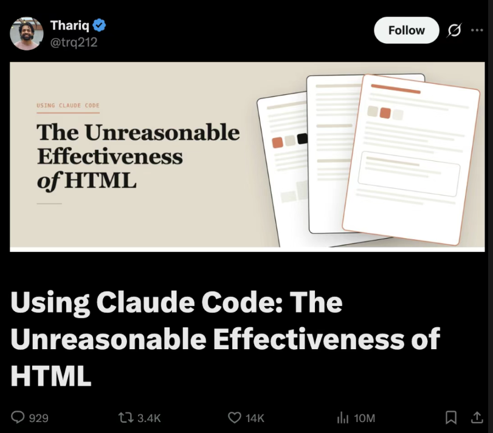

<!-- mdrise:banner -->
<div align="center">

### 👉 [看渲染版 / View styled HTML →](./README.html)

</div>

<!-- /mdrise:banner -->

<div align="center">

# mdrise

**让 Markdown 升维成可分享的 HTML · Elevate any Markdown into a shareable HTML.**

[🇨🇳 中文](#中文) · [🇺🇸 English](#english)

</div>

---

<a id="中文"></a>

# 中文

## 背景：Markdown 真的要凉了吗？

2026 年初，Anthropic 工程师 Thariq 发了一篇长文《**Using Claude Code: The Unreasonable Effectiveness of HTML**》，全网炸了——929 评论、3.4K 转发、14K 赞、1000 万阅读：



量子位翻成中文标题叫《[Markdown 要凉…卡帕西也站 HTML 了](https://x.com/trq212/status/2052809885763747935)》。核心论点：

> 我现在不管是做规划、需求设计、方案探索，还是代码审查和整理报告，全都在用 HTML。

文章列了五条 HTML > Markdown 的理由：信息密度、可读性、零成本分享、交互能力、快乐感。

## 但是 — Markdown 没死，只是退到了「源格式」

仔细看 Thariq 自己说的："我**几乎不亲手编辑这些文件**了，更多是拿它们当规范、参考文档或者头脑风暴的产出。"

也就是说，**AI 写的还是 Markdown**。**人类要读的才是 HTML**。

Markdown 仍然有 5 个 HTML 替代不了的功能：

| 功能 | 说明 |
|---|---|
| **Git diff** | 行级 diff 干净可读；HTML 的标签噪音让 PR review 几乎不可能 |
| **可移植** | 任何编辑器、任何系统、任何工具链都认 |
| **不污染 token** | 喂给 LLM 时没有标签噪音，纯信息密度 |
| **Source of truth** | 一份源，能导出 HTML / PDF / DOCX / PPTX 全套 |
| **Version control** | 30 年的工具积累全部适用 |

所以 Markdown 的位置已经在变。未来 AI 系统的架构大概率是：

```
AI
 ↓
MD / JSON / AST          ← 源格式（Git 层）
 ↓
HTML Component Tree      ← 渲染层（人类阅读）
 ↓
人类阅读
```

**Markdown 会逐渐退化成：**

- 导出格式 — 一份源可以导出多种成品
- 兼容层 — 跟旧工具链握手
- 纯文本 fallback — 没法渲染 HTML 时降级
- Git 层 — 版本控制、diff、review

**而不是主交互层。** 主交互层是 HTML（甚至按 Karpathy 的说法，终点可能是某种直接生成的交互视频）。

## HTML 自己的短板，恰好需要 MD 来补

文章评论区有人问：HTML 这么好，那**版本控制怎么办**？HTML 的 diff 是出了名的"吵"——一改动几行内容，标签、样式、属性的变化淹没掉真正的差异，让 PR review 几乎不可能。Thariq 自己也承认：这是 HTML 最大的短板，没有完美解决方案。

但其实有——只是答案不在 HTML 这一侧。

**让 MD 留在 Git 里。HTML 只在需要给人看的时候按需生成。**

```
.md  →  Git 仓库（version control / diff / review / source of truth）
 ↓ mdrise（按需）
.html  →  分享 / 阅读 / 邮件 / 打印（人类视觉成品）
```

这是 `mdrise` 设计上最关键的一点：你不需要在 "Markdown vs HTML" 里选边，而是让它们**各干各的事**——

- **MD 干 MD 擅长的**：Git diff、可移植、不污染 token、source of truth、version control
- **HTML 干 HTML 擅长的**：信息密度、可读性、零成本分享、交互、阅读快乐

`mdrise` 就是这两者中间那个**自动桥**：AI 写 `.md` 提交进 Git；需要给人看的时候，一句"做成网页"就生成 `.html`。`.html` 是临时视觉成品——扔了再生，零成本。

这就是为什么"AI 时代是颠覆性的"——不是因为 Markdown 死了，而是因为**它的角色从「人类的主要交互层」退回了「机器的源格式」**。它仍然不可替代，只是位置变了。

## 这是什么

一个 Claude skill。装上之后，让 Claude 把任何 `.md` 转成单文件 HTML，具备：

- **文字一字不改** — 不 paraphrase、不"修正"、不省略。源里有什么，HTML 里就有什么。
- **视觉自动判断** — Claude 先识别内容媒介（文档 / 书页 / 落地页 / 笔记…），再 pick 字体、色板、版式。不是统一模板。
- **侧边浮动目录** — 自动从 H2 / H3 生成，永久可见的展开图标随滚动跟着走，scroll-spy 高亮当前章节。
- **17+ 种文字脚本支持** — 拉丁、中日韩、阿拉伯希伯来（RTL）、西里尔、印地、泰米尔、孟加拉、泰文、高棉、缅文、格鲁吉亚、亚美尼亚、埃塞俄比亚……每种都有字体推荐表，Noto 家族兜底。
- **反 AI slop 三条铁律** — 禁用 Inter / Roboto / Arial、禁用紫渐变白底 hero、禁止把书页美学塞给非文学内容。
- **单文件输出** — CSS 全内联，唯一外部资源是 Google Fonts CDN。一个 `.html` 文件，邮件附件就能传。

## 不重复劳动：源没变就不重渲

`mdrise` 把 `.md ↔ .html` 当成一对镜像在维护，不是无脑触发。每次生成的 HTML 头部都会嵌入一段源文件的 SHA-256 指纹：

```html
<meta name="mdrise-source-hash" content="sha256:9c01140d59119d59e0...">
<meta name="mdrise-generated-at" content="2026-05-12T09:08:27Z">
```

下次你（或 Claude 自己）想"做成网页"的时候，skill 先读现有 HTML 的 hash，跟当前 MD 算一遍 hash 对比，按这张表决定：

| 状态 | 行为 |
|---|---|
| `.html` 不存在 | 直接生成 |
| `.html` 存在，但 hash 跟源不匹配（MD 改过了）| **直接重渲** — 典型场景：AI 刚改完 README |
| `.html` 存在，hash 跟源一致（in sync）| **询问你** 要不要重渲，不擅自动手 |
| 你说 "force / 重新生成" | 跳过检查直接重渲 |

这意味着 `mdrise` 可以被反复调用而不污染文件——每次对话只要提到 README，不会重复跑一遍 HTML 生成。这才是"**自动维护 markdown→HTML 镜像**"该有的样子。

为什么用 hash 不用文件 mtime：`git clone` 会把所有文件的 mtime 重置成 clone 时间，mtime 不可信。Hash 锚定的是源**内容**，跨 clone 跨设备都准。

## 实战示例（5个真实测试）

每个都跑了 with-skill 和 baseline（不装 skill 让 Claude 裸做）。点链接看实际渲染效果：

| 内容 | 语言 | 媒介 | with mdrise | baseline |
|---|---|---|---|---|
| Lumie 项目自检报告 | 中文 | 技术文档 | [docs 风、玉青色、左侧 ToC](./examples/lumie-zh-with-skill.html) | [紫粉 aurora 渐变 + 玻璃卡片（AI 默认）](./examples/lumie-zh-baseline.html) |
| 搬到新城市的第一年 | 中文 | 个人随笔 | [米纸 + 霞鹜文楷 + ❖ + 「目」字 toggle](./examples/essay-zh-with-skill.html) | [也能凑合，但没 ToC](./examples/essay-zh-baseline.html) |
| Glimpse JSON 可视化 | 英文 | 产品落地页 | [Linear 暗黑 + Geist + 电光绿](./examples/glimpse-en-with-skill.html) | [dark + **Inter** + 通用卡片](./examples/glimpse-en-baseline.html) |
| 鏡 Kagami SSG | 日文 | 技术 README | [Vercel / Linear 暗黑 + Noto Sans JP](./examples/kagami-ja-with-skill.html) | [Noto Serif JP body + 印章风（书味跑偏）](./examples/kagami-ja-baseline.html)|
| 大马士革晨咖啡 | 阿拉伯文 | 文学随笔 | [RTL + Amiri + Aref Ruqaa + 镜像 ToC + 变音符号验证](./examples/coffee-ar-with-skill.html) | [RTL 对了，字体也对，但缺 ToC 和 Latin 隔离](./examples/coffee-ar-baseline.html) |

## 安装

### Claude Code CLI

```
/plugin marketplace add YukiOvOb/mdrise
/reload-plugins
```

或者本地装：

```
claude --plugin-dir ./mdrise.skill
```

### Claude 桌面 / 网页

把 `mdrise.skill` 文件传到 [claude.ai](https://claude.ai) 的 skills 上传入口。

## 使用

直接跟 Claude 说人话：

```
> 把 README.md 做成网页
> render this article as html
> 美化这篇文章
> turn my notes into a webpage
> 做个项目主页
> 排版一下这个 markdown
```

或者最自然的工作流：让 Claude 写完 `plan.md` / `report.md` 之后，跟一句"**做成网页**"。

工作目录里有 `README.md` 时，任何"做成网页 / 美化 / 做个主页"类的请求会自动选这个 skill——这是写在 description 里的硬规则。

## 设计哲学

**两个不可变约束：**

1. **文字一字不差**——所有 enhancement 都是视觉层的加法，从不替换或重述源文字。
2. **视觉必须升维**——目标是"分得出去"的水平，不是 default browser rendering。

**核心方法论：先判断媒介，再挑美学。**

- 文学 → 书页（米纸 + 衬线正文 + 古典分割符 + 窄栏）
- 技术 → 文档站（Stripe / Vercel / Anthropic docs 调性，干净屏幕原生）
- 产品 → 落地页（Linear / Resend 调性，现代设计感）
- 这条边界是核心——书页美学**只**给文学内容。技术 / 产品文档用了就是 category error。

**多语言策略：** 先识别脚本（CJK / 阿拉伯 / 西里尔 / 印地…），再挑字体覆盖（Noto 家族兜底），再判断方向（LTR / RTL）和布局。RTL 用逻辑 CSS（`padding-inline-start` 等）而不是 `left / right`。

完整设计原则见 [SKILL.md](SKILL.md)。

## 贡献 & 反馈

欢迎 issue 和 PR。如果 `mdrise` 对你的某个特定内容类型不奏效，请：
1. 发个 issue，贴上源 `.md` 和你期望的视觉方向
2. 我会用同样的 4 步迭代法（draft skill → run subagents → review → revise）把它修进去

## 致谢 / 打赏

`mdrise` 完全开源（MIT）。如果它帮你省下了排版的时间，或者你想支持我继续打磨它，欢迎请我喝杯咖啡：

- **Buy Me a Coffee**：https://buymeacoffee.com/midasovorh （国际）
- **微信 / 支付宝**：


接受各种形式的支持：把 mdrise 转发给一个用 Claude 写 README 的朋友，给仓库点个 ⭐，或者用它做出来一份漂亮的 HTML 然后发给我看看——那就是最大的鼓励。

## License

MIT。详见 [LICENSE](LICENSE)。

---

<a id="english"></a>

# English

## Background — is Markdown really dying?

In early 2026, Anthropic engineer Thariq published an essay titled **"Using Claude Code: The Unreasonable Effectiveness of HTML"** that went viral — 929 comments, 3.4K retweets, 14K likes, 10M views:


The core claim:

> Whether I'm planning, drafting specs, exploring solutions, reviewing code, or organizing reports — I now do all of it in HTML.

The essay lists five reasons HTML beats Markdown: density, readability, zero-friction sharing, interaction, and joy. Every one of them is true.

## But — Markdown isn't dead. It just retreated to "source format."

Read what Thariq actually said: "I rarely **hand-edit** these files anymore — I use them as specs, reference docs, brainstorming output. If I need to change something, I usually just throw it at Claude."

In other words: **AI still writes Markdown**. **Humans still read HTML**.

Markdown retains five functions that HTML can't replace:

| Function | Why it survives |
|---|---|
| **Git diff** | Line-level diffs are clean and reviewable. HTML's tag noise makes PR review nearly impossible. |
| **Portability** | Every editor, every system, every toolchain understands it. |
| **No token pollution** | When fed to LLMs, no tag overhead — pure information density. |
| **Source of truth** | One source exports to HTML / PDF / DOCX / PPTX. |
| **Version control** | 30 years of accumulated tooling apply directly. |

So Markdown's position is shifting. The likely future architecture of AI systems looks like this:

```
AI
 ↓
MD / JSON / AST          ← source format (Git layer)
 ↓
HTML Component Tree      ← render layer (human reading)
 ↓
Human reader
```

**Markdown will gradually become:**

- An export format — one source, many downstream artifacts
- A compatibility layer — shaking hands with older toolchains
- A plain-text fallback — graceful degradation when HTML can't render
- A Git layer — version control, diff, review

**Not the primary interaction layer.** That's HTML — and eventually, per Karpathy, perhaps some directly-generated interactive video.

## HTML's weakness is exactly where MD fills the gap

Commenters on Thariq's essay asked the obvious question: HTML is great, but what about **version control**? HTML diffs are notoriously noisy — change a few lines of content, and the tag, style, and attribute churn drowns out the actual difference. PR review becomes nearly impossible. Thariq himself acknowledged: this is HTML's biggest weakness, with no perfect solution.

But there is a solution — it just isn't on the HTML side.

**Keep MD in Git. Render HTML on demand, only when humans need to read it.**

```
.md  →  Git repo (version control / diff / review / source of truth)
 ↓ mdrise (on demand)
.html  →  share / read / email / print (human visual artifact)
```

This is the most important point in `mdrise`'s design. You don't have to pick a side in "Markdown vs HTML." You let each **do what it does best**:

- **MD does what MD does well**: Git diff, portability, no token pollution, source of truth, version control
- **HTML does what HTML does well**: information density, readability, zero-cost sharing, interaction, reading pleasure

`mdrise` is the **automatic bridge** between them: AI writes the `.md` and commits it to Git; when a human needs to read it, one "make it a webpage" produces the `.html`. The `.html` is a disposable visual artifact — regenerate any time, zero cost.

This is what makes the AI era genuinely disruptive — not that Markdown died, but that **its role shifted from "primary interaction layer for humans" back to "source format for machines."** It's still indispensable; the position just changed.

## What this is

A Claude skill. Install it, then ask Claude to convert any `.md` into a single-file HTML that:

- **Preserves every word verbatim** — no paraphrasing, no "fixing," no omission. What's in the source is in the HTML.
- **Auto-selects visual style** — Claude first identifies the content's medium (docs / book page / landing / notebook…) then picks fonts, palette, layout. Not a uniform template.
- **Floats a side table-of-contents** — auto-generated from H2 / H3, a persistent toggle stays visible as you scroll, scroll-spy highlights the current section.
- **Supports 17+ writing scripts** — Latin, CJK, Arabic & Hebrew (RTL), Cyrillic, Devanagari, Tamil, Bengali, Thai, Khmer, Burmese, Georgian, Armenian, Ethiopic… each with a font recommendation table, with the Noto family as universal fallback.
- **Three anti-slop rules** — no Inter / Roboto / Arial, no purple-gradient-on-white hero, no book-page aesthetics on non-literary content.
- **Single-file output** — all CSS inlined, only external resource is Google Fonts. One `.html` file you can send as an email attachment.

Not just slapping marked.js + a default Bootstrap theme on it — that turns ugly markdown into ugly markdown rendered. The goal is for Claude to **recognize what kind of document this is** and **pick a visual language that matches**: a technical README gets Vercel / Stripe docs vibes, a personal essay gets a printed book page, a product launch gets a Linear-style landing page, an Arabic literary piece gets a right-to-left book page — all auto-decided.

## No redundant work — only rerender when the source changed

`mdrise` treats `.md ↔ .html` as a maintained mirror pair, not a blind trigger. Each generated HTML embeds a SHA-256 fingerprint of the source in the head:

```html
<meta name="mdrise-source-hash" content="sha256:9c01140d59119d59e0...">
<meta name="mdrise-generated-at" content="2026-05-12T09:08:27Z">
```

Next time you (or Claude) wants to "make it a webpage", the skill reads the hash from the existing HTML, computes a fresh hash of the current MD, and decides from this table:

| State | Behavior |
|---|---|
| `.html` doesn't exist | Generate immediately |
| `.html` exists but hash doesn't match (MD was edited) | **Regenerate** — typical case: AI just modified README |
| `.html` exists and hash matches (in sync) | **Ask you** before regenerating, don't act blindly |
| You say "force / 重新生成" | Skip the check, always regenerate |

This makes `mdrise` safely idempotent — invoke it as often as you want; it won't churn out a new HTML every conversation that happens to mention the README. That's what "**automatic maintenance of a markdown→HTML mirror**" actually means.

Why hash instead of file mtime: `git clone` resets every file's mtime to the clone moment, so mtime is unreliable. Hashes anchor to source **content** — consistent across clones and devices.

## Real-world examples (5 test cases)

Each was rendered both with-skill and as a no-skill baseline. Click any link to see the actual rendered output:

| Content | Language | Medium | With mdrise | Baseline |
|---|---|---|---|---|
| Lumie project audit report | Chinese | technical docs | [docs vibe, jade-teal, left-rail ToC](./examples/lumie-zh-with-skill.html) | [purple aurora gradient + glass cards (AI default)](./examples/lumie-zh-baseline.html) |
| First year in a new city | Chinese | personal essay | [rice-paper + LXGW WenKai + ❖ + 「目」toggle](./examples/essay-zh-with-skill.html) | [OK-ish but no ToC](./examples/essay-zh-baseline.html) |
| Glimpse JSON visualizer | English | product launch | [Linear-dark + Geist + electric lime](./examples/glimpse-en-with-skill.html) | [dark + **Inter** + generic cards](./examples/glimpse-en-baseline.html) |
| 鏡 Kagami SSG | Japanese | technical README | [Vercel / Linear dark + Noto Sans JP](./examples/kagami-ja-with-skill.html) | [Noto Serif JP body + seal motif (book-trap)](./examples/kagami-ja-baseline.html) |
| Damascus morning coffee | Arabic | literary essay | [RTL + Amiri + Aref Ruqaa + mirrored ToC + diacritic verification](./examples/coffee-ar-with-skill.html) | [RTL applied, fonts good, but no ToC, no Latin isolation](./examples/coffee-ar-baseline.html) |

## Install

### Claude Code CLI

```
/plugin marketplace add YukiOvOb/mdrise
/reload-plugins
```

Or install locally:

```
claude --plugin-dir ./mdrise.skill
```

### Claude desktop / web

Upload `mdrise.skill` via the skills uploader on [claude.ai](https://claude.ai).

## Use

Just talk to Claude:

```
> turn README.md into a webpage
> render this article as html
> make my notes look nice
> create a project homepage
> 做成网页
> 美化这篇文章
```

The most natural workflow: after Claude finishes writing a `plan.md` / `report.md`, just say "**make it a webpage**."

When `README.md` exists in the working directory, any "make it a webpage / homepage / look nice" request auto-routes to this skill — that's a hard rule baked into the skill description.

## Design philosophy

**Two invariants:**

1. **Text fidelity** — every visual enhancement is additive. Never replace or paraphrase source text.
2. **Visual elevation** — target is "shareable" quality, not default browser rendering.

**Core method: identify the medium first, then pick aesthetics.**

- Literary → book page (warm paper + serif body + classical dividers + narrow column)
- Technical → docs site (Stripe / Vercel / Anthropic docs vibe — clean, screen-native)
- Product → landing page (Linear / Resend vibe — modern, designed)
- This boundary is central. Book-page aesthetics belong to literary content **only**. Using them on technical / product docs is a category error.

**Multi-language strategy:** identify script first (CJK / Arabic / Cyrillic / Devanagari…), pick fonts that cover it (Noto family as safe default), then handle direction (LTR / RTL) and layout. RTL uses logical CSS (`padding-inline-start`, etc.), not `left` / `right`.

Full design principles: see [SKILL.md](SKILL.md).

## Contributing

Issues and PRs welcome. If `mdrise` fails on a content type you care about:
1. Open an issue with the source `.md` and the visual direction you want
2. I'll iterate on the skill using the same 4-step loop (draft → subagent runs → review → revise)

## Sponsor / Donate

`mdrise` is fully open source (MIT). If it saved you time on layout, or you want to support continued polish, buy me a coffee:

- **Buy Me a Coffee** (international): https://buymeacoffee.com/midasovorh
- **WeChat / Alipay**:


Any support welcome: share `mdrise` with someone who writes README files with Claude, star the repo, or render something beautiful with it and send me the result — that's the biggest encouragement.

## License

MIT. See [LICENSE](LICENSE).

---

<div align="center">

> "Markdown is dead." — Thariq, 2026  
> "Markdown isn't dead — it just finally found its right place." — mdrise

</div>
